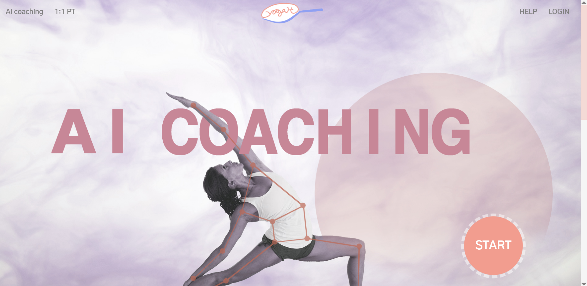
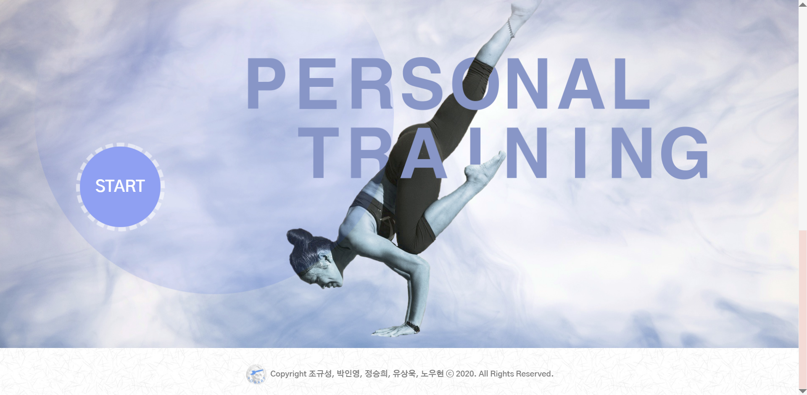
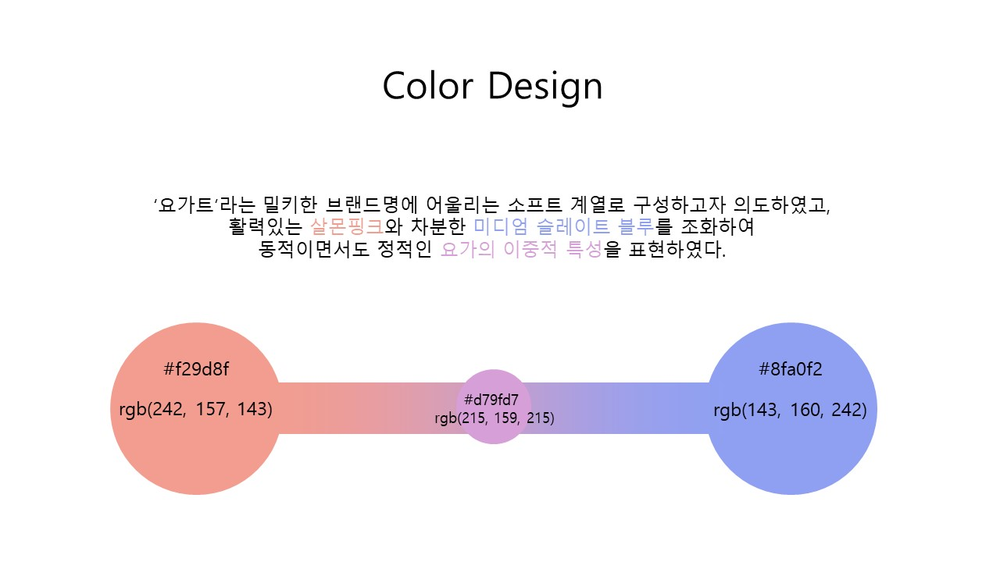

<p align="center">
  
</p>
  <h2 align="center">YOGART</h2>
  <h6 align="center">내 마음 속에 요가트 한 스푼</h6>


  <p align="center">
    AI 기반 요가 자세 코칭 및 1:1 요가 수업 매칭 플랫폼
    <br />
    <br />
    <a href="imgForREADME/frame.pdf"><strong>와이어 프레임 초안</strong></a>
    · 
    <a href="https://docs.google.com/document/d/1mni5wXHhc3lFoP_9c4rojFkBvvPv2uf-ai3y7hOMw-I/edit"><strong>프로젝트 계획서</strong></a></p>


> > 메인 페이지
<p align="center">

    
</p>


## :paperclip: 프로젝트 소개


> > 기획 의도
> >
> > 

- 포스트 코로나라는 시대적 흐름에 맞춰 홈트레이닝이라는 주제를 선정하였고 요가라는 분야가 사람들의 관심에 비해 제공되는 서비스가 적어 선택했습니다.

  

- 단순한 동영상 서비스를 제공하는 것이 아니라 즉각적인 피드백을 제공하고자 라이브 스트리밍을 구현했고 티처블 머신을 사용했습니다.


> > 주요 기능
> >
> > 

- Teachable Machine을 사용한 AI coaching service를 통해 사용자의 자세를 인식하고 기준자세와 비교한 피드백을 제공합니다.

  

- 사용자가 원하는 자세를 모아 리스트를 만들어 트레이닝을 진행할 수 있고 운동 기록과 코칭 서비스의 피드백 데이터를 그래프로 제공합니다.


- AI요가 코칭 서비스보다 심화단계를 원하는 사용자, 집에서 단방향이 아닌 소통하는 트레이닝을 원하는 사용자들을 위해 webRTC를 이용한 라이브 스트리밍으로 1:1 요가 개인 지도 서비스를 제공합니다.

  

- 개인 지도를 제공하는 강사는 자격증과 경력 등을 통해 선별합니다.

  

- 미리 스푼을 구매한 뒤, 차감하는 방식으로 사용자의 편의성을 높이고 서비스를 지속적으로 이용하도록 유도했습니다.


> > 디자인 기획
> >
> > 




> > 주요 기술 스택
> >
> > 

### 사용언어
- JAVA
- JavaScript
- NodeJS
- CSS

<div align="center">


</div>


### 프레임워크
- Spring Boot Framework
- Vue.js
- Swagger

<div align="center">


</div>


### Database / Server
- Maria-DB / MySQL
- Apache Tomcat


### 라이브러리 / API
- Teachable Machine
- WebRTC
- ChartJS
- Google Chart
- Toast Editor
- JPA
- KakaoAPI (Kakao Login / Kakao Pay)
- Naver Login API

<div align="center">


</div>


> > 다운로드 및 실행 방법
> >
> > 

### 소스코드 다운로드

```sh
git clone https://lab.ssafy.com/s03-webmobile1-sub3/s03p13d202.git
```
### 클라이언트 실행
```sh
cd frontend/yogart/
npm install
npm run serve -- --port 3000
```

### 서버 실행
```sh
cd backend/yogart/
apt-get install maven
mvn spring-boot:run
```


> > Contact
> >
> > 

### 삼성 청년 소프트웨어 아카데미(SSAFY) 3기 공통 프로젝트 - D202

- 프론트엔드 개발자
  - 조규성 - pandora_h@naver.com 
  - 박인영 - in0_2015@naver.com 
  - 정승희 - seunghee6022@gmail.com 
- 백엔드 개발자
  - 유상욱 - sizn08@naver.com 
  - 노우현 - ydav2295@gmail.com 


- Project Link: [https://lab.ssafy.com/s03-webmobile1-sub3/s03p13d202](https://lab.ssafy.com/s03-webmobile1-sub3/s03p13d202)

